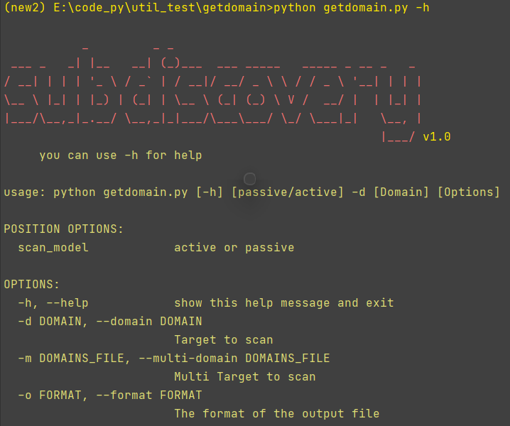

# getdomain

#### 介绍

用于在渗透测试中实现一键式**域名挖掘、过滤**等操作，以主动和被动两种模式进行，全部是async**异步实现并发**搜索，速度快，涵盖了子域名、兄弟域名等大部分可能的域名资产搜集，很方便的扩展安全测试的广度、测试面，避免手动搜集的繁琐以及不全面。

**Tips：由于相关原因，开发暂时停滞，未来有需要的话可能会重启项目**

#### 软件架构

Python 3.6以上均可

#### 功能简介
1.  被动搜集
    1.  各大搜索引擎搜集 √
    2.  DNS记录公开数据搜集 √×
    3.  DNS记录中的SRV,MX,NS,SOA,TXT记录搜集 ×
    4.  域名备案信息搜集 ×
    5.  域传送漏洞搜集 √
    6.  证书透明度搜集 √
    7.  威胁情报网搜集 √
    8.  Whois反查搜集 √
    
2.  主动搜集
    1.  域名暴力破解 √×
    2.  换置、排序爆破（利用已知的子域名）×
    3.  CSP搜集 √
    4.  前端源码泄露 √×
    5.  敏感文件泄露 √
    6.  深度递归检索 ×
    
3.  结果过滤 ×
    对域名资产进行可用性筛选，得到不重复、可用的域名，并以某种指标进行优先级排序（如seo）

#### 安装教程

```bash
cd ./getdomain
pip install -r requirements.txt
```

#### 使用说明




